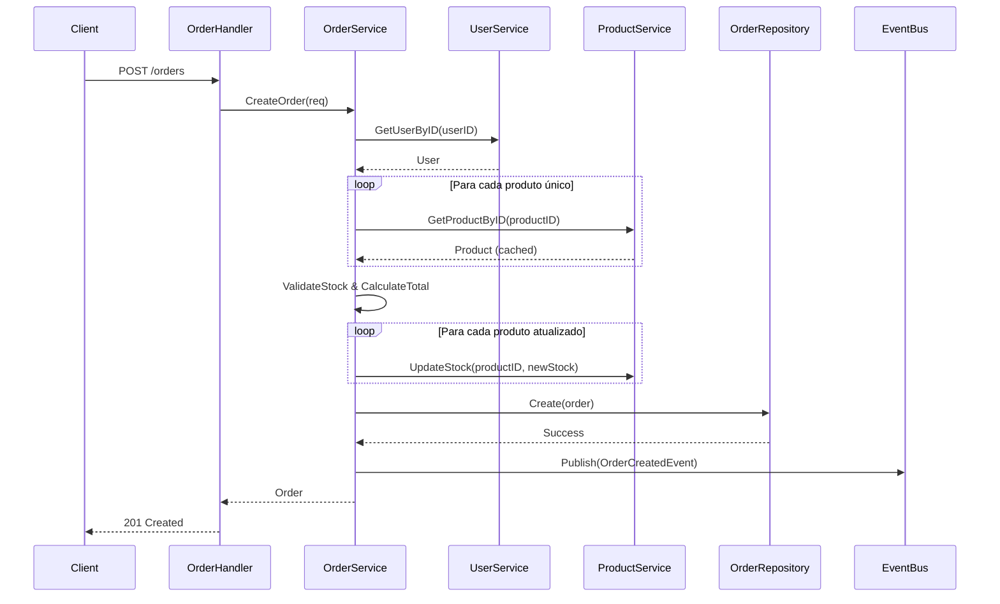

# Order Module 🛒

O módulo Order implementa um sistema completo de pedidos com gestão integrada de estoque, seguindo Clean Architecture e DDD.

## 🎯 Responsabilidades

- **Sistema de Pedidos**: Criação de pedidos com múltiplos itens
- **Gestão de Status**: Controle do ciclo de vida do pedido
- **Integração de Estoque**: Validação e atualização automática
- **Cancelamentos**: Reversão de estoque e status
- **Eventos de Domínio**: Notificações de criação, atualização e cancelamento
- **Otimização de Performance**: Cache de produtos e agregação de quantidades

## 🏗️ Estrutura do Módulo

```
order/
├── domain/
│   ├── order.go               # Entidade Order e OrderAggregate
│   └── repository.go          # Interface OrderRepository (Port)
├── service/
│   └── order_service.go       # Casos de uso com otimizações
├── repository/
│   └── mysql_order_repository.go # Persistência transacional
└── handler/
    └── order_handler.go       # HTTP handlers RESTful
```

## 📡 API Endpoints

### Base URL: `/api/v1/orders/`

#### Criar Pedido
```http
POST /api/v1/orders/
Content-Type: application/json

{
  "user_id": "uuid-of-user",
  "items": [
    {
      "product_id": "prod-001",
      "quantity": 2
    },
    {
      "product_id": "prod-002",
      "quantity": 1
    }
  ]
}
```

**Response (201):**
```json
{
  "id": "uuid-generated",
  "user_id": "uuid-of-user",
  "items": [
    {
      "product_id": "prod-001",
      "quantity": 2,
      "price": 8999.99
    },
    {
      "product_id": "prod-002",
      "quantity": 1,
      "price": 2499.99
    }
  ],
  "status": "pending",
  "total": 20499.97,
  "created_at": "2025-09-23T20:33:20Z",
  "updated_at": "2025-09-23T20:33:20Z"
}
```

#### Buscar Pedido
```http
GET /api/v1/orders/{id}
```

#### Listar Pedidos do Usuário
```http
GET /api/v1/orders/user/{user_id}
```

#### Atualizar Status do Pedido
```http
PUT /api/v1/orders/{id}/status
Content-Type: application/json

{
  "status": "confirmed"
}
```

**Status Válidos:**
- `pending` - Pedido pendente
- `confirmed` - Pedido confirmado
- `shipped` - Pedido enviado
- `delivered` - Pedido entregue
- `cancelled` - Pedido cancelado

#### Cancelar Pedido
```http
POST /api/v1/orders/{id}/cancel
```

**Response (200):**
```json
{
  "id": "order-uuid",
  "status": "cancelled",
  "message": "Order cancelled successfully"
}
```

## 🔄 Eventos Publicados

### OrderCreatedEvent
Disparado quando um pedido é criado com sucesso.

```json
{
  "type": "OrderCreatedEventType",
  "payload": {
    "order_id": "uuid",
    "user_id": "uuid",
    "total": 20499.97
  },
  "timestamp": "2025-09-23T20:33:20Z"
}
```

### OrderStatusUpdatedEvent
Disparado quando o status de um pedido é atualizado.

```json
{
  "type": "OrderStatusUpdatedEventType",
  "payload": {
    "order_id": "uuid",
    "old_status": "pending",
    "new_status": "confirmed"
  },
  "timestamp": "2025-09-23T20:33:20Z"
}
```

### OrderCancelledEvent
Disparado quando um pedido é cancelado.

```json
{
  "type": "OrderCancelledEventType",
  "payload": {
    "order_id": "uuid",
    "user_id": "uuid",
    "cancelled_at": "2025-09-23T20:33:20Z"
  },
  "timestamp": "2025-09-23T20:33:20Z"
}
```

## 🏛️ Arquitetura

### Camada de Domínio
- **Order**: Entidade principal com items e status
- **OrderItem**: Value object para itens do pedido
- **OrderAggregate**: Agregado com validações complexas
- **OrderStatus**: Enum com transições válidas

### Camada de Aplicação
- **OrderService**: Orquestra casos de uso complexos
  - Validação de usuário e produtos
  - Cache de produtos para performance
  - Agregação de quantidades por produto
  - Gestão transacional de estoque
  - Publicação de eventos

### Camada de Infraestrutura
- **MySQLOrderRepository**: Persistência transacional
- **OrderHandler**: Endpoints HTTP RESTful

## ⚡ Otimizações de Performance

### Cache de Produtos
Para evitar múltiplas consultas ao ProductService:

```go
// Cache de produtos para evitar múltiplas consultas
productCache := make(map[string]*contracts.Product)
```

### Agregação de Quantidades
Quando o mesmo produto aparece múltiplas vezes:

```go
// Agregar quantidades por produto
updatedProducts := make(map[string]int)
for _, item := range orderItems {
    updatedProducts[item.ProductID] += item.Quantity
}
```

### Transações
Operações atômicas para consistência:

```go
// Operação transacional para consistência
tx := r.db.Begin()
defer tx.Rollback()
// ... operações
tx.Commit()
```

## 🗄️ Modelo de Dados

### Tabela: `orders`
```sql
CREATE TABLE orders (
    id VARCHAR(36) PRIMARY KEY,
    user_id VARCHAR(36) NOT NULL,
    status ENUM('pending', 'confirmed', 'shipped', 'delivered', 'cancelled') DEFAULT 'pending',
    total DECIMAL(10,2) NOT NULL,
    created_at TIMESTAMP DEFAULT CURRENT_TIMESTAMP,
    updated_at TIMESTAMP DEFAULT CURRENT_TIMESTAMP ON UPDATE CURRENT_TIMESTAMP,
    FOREIGN KEY (user_id) REFERENCES users(id) ON DELETE CASCADE,
    INDEX idx_orders_user (user_id),
    INDEX idx_orders_status (status),
    INDEX idx_orders_created (created_at)
);
```

### Tabela: `order_items`
```sql
CREATE TABLE order_items (
    id VARCHAR(36) PRIMARY KEY,
    order_id VARCHAR(36) NOT NULL,
    product_id VARCHAR(36) NOT NULL,
    quantity INT NOT NULL,
    price DECIMAL(10,2) NOT NULL,
    created_at TIMESTAMP DEFAULT CURRENT_TIMESTAMP,
    FOREIGN KEY (order_id) REFERENCES orders(id) ON DELETE CASCADE,
    FOREIGN KEY (product_id) REFERENCES products(id) ON DELETE RESTRICT,
    INDEX idx_order_items_order (order_id),
    INDEX idx_order_items_product (product_id)
);
```

## 🔗 Integração com Outros Módulos

### User Module
- **Validação**: Verifica se o usuário existe antes de criar pedido
- **Relacionamento**: FK para garantir integridade referencial

### Product Module  
- **Validação de Produtos**: Verifica existência de cada produto
- **Controle de Estoque**: Valida disponibilidade e atualiza quantidades
- **Preços**: Captura preço atual no momento do pedido
- **Reversão**: Restaura estoque em cancelamentos

## 🚨 Regras de Negócio

### Criação de Pedidos
1. **Usuário Válido**: Deve existir no sistema
2. **Produtos Válidos**: Todos os produtos devem existir
3. **Estoque Suficiente**: Quantidade disponível >= quantidade solicitada
4. **Preço Atual**: Captura preço no momento da criação
5. **Cálculo de Total**: Soma automática de todos os itens

### Transições de Status
- `pending` → `confirmed`, `cancelled`
- `confirmed` → `shipped`, `cancelled`
- `shipped` → `delivered`
- `delivered` → (status final)
- `cancelled` → (status final)

### Cancelamentos
- **Permitido**: Apenas pedidos `pending` ou `confirmed`
- **Reversão de Estoque**: Automática para todos os itens
- **Evento**: Publicação de OrderCancelledEvent

## 🧪 Testes

O módulo Order possui testes extensivos no `test_api.sh`:

### Cenários Testados
1. **Criação com Múltiplos Items**: iPhone + AirPods Pro
2. **Busca por ID**: Verificação dos dados criados
3. **Listagem por Usuário**: Todos os pedidos do usuário
4. **Atualização de Status**: pending → confirmed → shipped
5. **Tentativa de Cancelamento**: Pedido já enviado (deve falhar)
6. **Cancelamento Válido**: Pedido pending (deve funcionar)
7. **Produto Inexistente**: Deve retornar erro
8. **Estoque Insuficiente**: Quantidade > estoque (deve falhar)

### Casos de Erro Testados
```bash
# Produto inexistente
curl -X POST /api/v1/orders/ \
  -d '{"user_id":"uuid","items":[{"product_id":"inexistente","quantity":1}]}'

# Estoque insuficiente  
curl -X POST /api/v1/orders/ \
  -d '{"user_id":"uuid","items":[{"product_id":"prod-001","quantity":999}]}'
```

## 📊 Fluxo de Criação de Pedidos



## 🚀 Melhorias Futuras

### Funcionalidades Planejadas
- [ ] **Sistema de Pagamentos**: Integração com gateways
- [ ] **Cupons de Desconto**: Aplicação de promoções
- [ ] **Frete**: Cálculo automático por CEP
- [ ] **Rastreamento**: Código de rastreio dos correios
- [ ] **Histórico de Status**: Log de todas as mudanças
- [ ] **Notificações**: Email/SMS para mudanças de status
- [ ] **Relatórios**: Dashboard de vendas e métricas
- [ ] **Produtos em Falta**: Lista de espera para restock

### Otimizações Técnicas
- [ ] **Cache Distribuído**: Redis para cache de produtos
- [ ] **Processamento Assíncrono**: Queue para operações pesadas  
- [ ] **Saga Pattern**: Transações distribuídas
- [ ] **CQRS**: Separação de leitura e escrita
- [ ] **Event Sourcing**: Histórico completo de eventos
- [ ] **Retry Policy**: Recuperação automática de falhas
- [ ] **Circuit Breaker**: Proteção contra falhas em cascata

### Melhorias de UX
- [ ] **Carrinho de Compras**: Persistência entre sessões
- [ ] **Checkout Simplificado**: Menos passos
- [ ] **Pagamento em 1 Click**: Dados salvos
- [ ] **Recompra Rápida**: Repetir pedidos anteriores